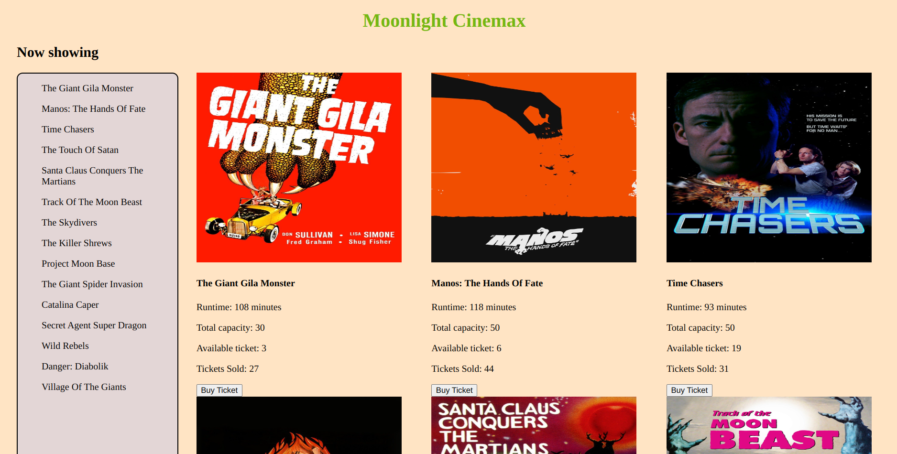

# Movie Ticket Booking Web App

This project is a Movie Ticket Booking Web App that allows users to view movie details, check available tickets, and purchase tickets for movies being shown in a theater. The app provides a user-friendly interface and dynamically updates ticket availability when users buy tickets.

## Features 
* Display details of the first movie, including its poster, title, runtime, showtime, and available tickets.
* Buy a ticket for a movie by clicking the "Buy Ticket" button.
* The number of available tickets is automatically derived by subtracting the number of tickets sold from the theater's capacity.
* Users cannot buy a ticket if the showing is sold out.

## How to Use the App
1. Click on this [link]() to open the web app. The details of the first movie including its poster, title, showtime, and available tickets will be displayed when the page loads.
2. On the left side of the page, you will see a menu containing all the available movies.
3. Click on a movie from the menu to view its details on the right side of the page.
4. To purchase a ticket for the selected movie, click the "Buy Ticket" button. The number of available tickets will be displayed but you will not be able to buy a ticket if the show is sold out.

## Note
The Movie Ticket Booking Web App uses a Theater API to fetch movie details, showtimes, and ticket availability.

## Technologies Used

  * HTML
  * CSS
  * JavaScript

## License
This project is licensed under the MIT License - see the [LICENSE] file for details.
